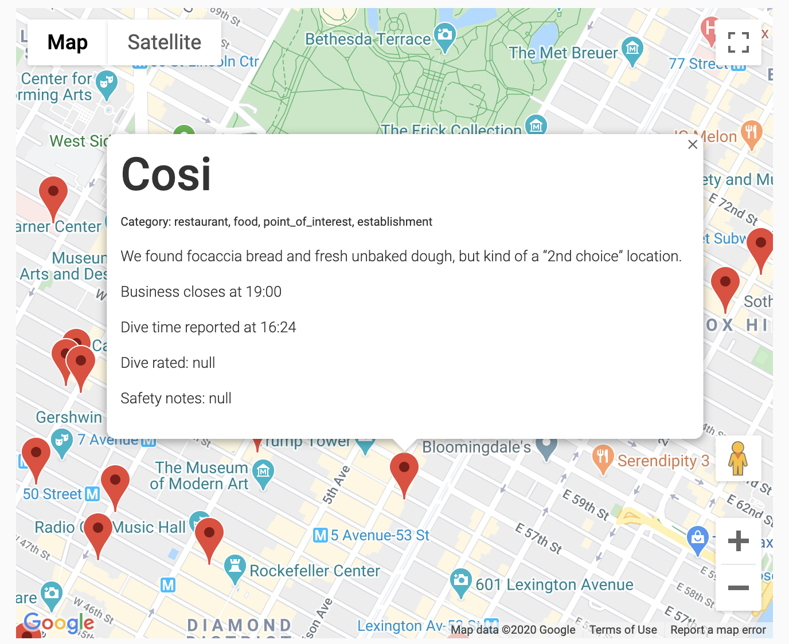
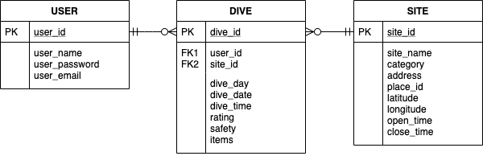

# QuiGlane (pronounced: "Key-Glan")

> Inspired by the film "Gleaners and I" by Agnes Varda, the underlying mission of this app is to redefine the dark, dirty, D.L. notions of dumpster-diving as a modern metropolitan form of gleaning.

> The app maps each dive review so that dumpster-divers can access and keep record of safe dives while connecting with one another to coordinate events.

## Technologies
- Python
- Flask
- WTForms
- Jinja2
- PostgreSQL
- SQLAlchemy ORM
- HTML
- CSS
- Twitter Bootstrap
- JavaScript (JQuery/AJAX, JSON, EasyAutocomplete)
- Google Places API
- Google Maps API

## Features

### User Handling
  - User registration, login, logout. 
  - Current user identification and access management (login required).

### Dive Map:
  - Dumpster markers include a popup info with:
    * Name of business (dumpster owner)
    * Dumpster address
    * Category of business
    * Business closing hours
    * Optimal dive time
    * Dive rating (from review)
    * Dive safety (from review)
  - Marker data is populated by a JSON API created from the database.

### Add new dive review:
  - New Review Existing Site:
    * Autocomplete available - displays results from database.
    * New dive will be added to the database under the respective site.
  - New Reveiw New Site:
    * A new site will be added to the database.
    * Basic information submitted through the form (business name and address) will run through Google Places API to populate additional location details: latitude, longitude, business category, closing and opening time.
    * Then the dive will be added in relation to the new site.

### User Profile "Dive Cards"
  - Displays each dive review as a card.
    * Each card unlocks other dive reviews with matching location via link.
    (Acts as a barrier to entry to safegaurd the community)
      - Unlocked reviews unveil reviewers' unique username.
    * Each review card can be updated or deleted upon verification of user.

## Database

